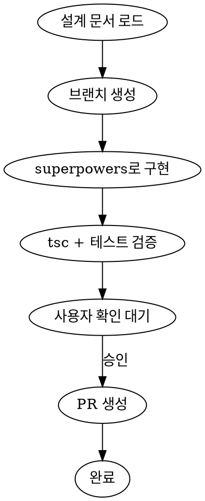

# Implement Plan

설계 문서를 기반으로 구현 → 사용자 확인 → PR 생성까지 한 세션에서 처리한다.



## Step 1: 설계 문서 로드

- 사용자가 지정한 `docs/plans/` 문서를 읽는다
- 브랜치명, 선행 조건, 성공 기준(DoD)을 추출한다
- 설계 문서에 명시된 브랜치명으로 브랜치를 생성한다

## Step 2: 구현

**REQUIRED SUB-SKILL:** `superpowers:executing-plans` 를 사용하여 설계 문서의 작업 항목을 순차 실행한다.

### 각 작업 항목마다

1. **작업 시작 전** — `frontend-conventions` 스킬을 호출하여, 해당 작업이 건드리는 영역(`typescript` / `component-structure` / `feature-public-api` / `global-state-boundary` / `folder-structure`)에 해당하는 규칙 문서를 읽는다. 작업마다 영역이 다를 수 있으므로 **매 항목마다 반복** 호출한다.
2. **코드 수정** — 읽은 규칙을 따라 구현한다.
3. **자기 검증 보고** — 적용한 규칙을 한 줄로 메모한다 (예: `typescript/README.md 의 배열 표기 규칙 적용`).

### 모든 작업 항목 완료 후: 검증

`superpowers:verification-before-completion` 스킬을 호출하여 "구현 완료" 를 주장하기 전 최종 검증을 수행한다. 이 게이트를 통과하지 못하면 Step 3 으로 넘어가지 않는다.

flowchart 상 "tsc + 테스트 검증" 단계에 해당하며, 다음을 실행한다:

- **타입 체크** — 프로젝트의 타입 검사 명령을 실행한다
- **테스트** — 프로젝트의 테스트 명령을 실행한다 (있는 경우)
- **결과 기록** — 통과 여부와 실패 내용을 메모한다. Step 3 의 "구현 결과 보고" 표에 그대로 옮긴다.

하나라도 실패하면 해결한 뒤 전체를 재실행한다. 실패를 해결하지 않고 Step 3 으로 넘어가지 않는다.

## Step 3: 사용자 확인 대기

구현 완료 후 다음을 출력하고 **사용자 승인을 기다린다:**

### 구현 결과 보고

| 항목 | 내용 |
|------|------|
| **변경 파일** | 생성/수정/삭제된 파일 목록 |
| **DoD 체크리스트** | 설계 문서의 성공 기준 각 항목별 ✅/❌ |
| **tsc --noEmit** | 통과 여부 (에러 있으면 내용 포함) |
| **테스트** | 통과 여부 (실패 있으면 기존 이슈인지 구분) |

### 사용자 확인 가이드

사용자가 무엇을 확인해야 하는지 구체적으로 안내한다:

```
## 확인 부탁드립니다

### 수동 확인 항목
- [ ] {설계 문서의 수동 검증 항목을 그대로 나열}

### 확인 포인트
- 변경된 파일이 설계 문서의 After 구조와 일치하는지
- 기존 동작이 깨지지 않았는지 (화면에서 직접 확인)
- 의도하지 않은 파일이 변경되지 않았는지

확인 후 "ㅇㅇ" 하시면 PR을 생성합니다.
수정이 필요하면 말씀해주세요.
```

## Step 4: PR 생성

사용자가 승인하면 `create-pr` 스킬을 사용하여 PR을 생성한다.

생성된 PR URL을 사용자에게 출력한다.
