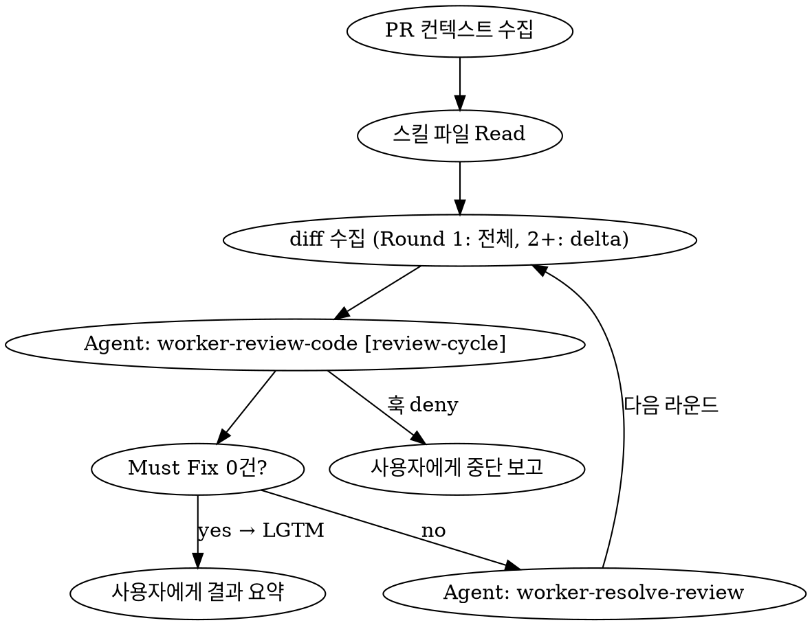

# Review Loop (오케스트레이터)

review → resolve → 재리뷰 루프를 서브에이전트로 자동 실행한다.
오케스트레이터는 루프 제어만 담당하며, 직접 리뷰/수정하지 않는다.

## 설계 원칙

- 오케스트레이터는 카운팅하지 않음 — `review-cycle-limit.mjs` 훅이 전담
- 서브에이전트에 스킬 내용을 프롬프트로 주입 — Skill 도구 호출에 의존하지 않음
- 각 서브에이전트는 PR에 직접 코멘트를 남김



## Step 1: PR 컨텍스트 수집

```bash
gh pr view <PR_NUMBER> --json number,title,body,baseRefName,headRefName
gh pr diff <PR_NUMBER> --name-only
```

- PR body 또는 브랜치명에서 `docs/plans/`의 관련 설계 문서 탐색
- 해당 브랜치 checkout

## Step 2: 스킬 파일 Read

```
Read .claude/skills/worker-review-code/SKILL.md → reviewSkillContent
Read .claude/skills/worker-resolve-review/SKILL.md → resolveSkillContent
```

두 스킬의 내용을 변수로 보관한다. 서브에이전트에 프롬프트로 주입하기 위함.

## Step 3: 루프

```
round = 1
loop:
  // diff 수집 — 매 라운드마다 최신 상태 반영
  if round == 1:
    diff = gh pr diff <PR_NUMBER>              // 전체 PR diff
  else:
    diff = git diff HEAD~1                     // 직전 resolve가 수정한 delta만

  // 리뷰 — 훅이 카운팅 ([review-cycle] 마커 필수)
  // review 서브에이전트는 "LGTM" 또는 "REVIEW_ID:{id}" + 건수를 반환
  reviewResult = Agent(
    description="[review-cycle] PR #N 리뷰",
    prompt=reviewSkillContent + PR메타정보 + diff
  )

  if reviewResult == "LGTM":
    break → Step 4

  // 수정 — 훅이 카운팅하지 않음 ([review-cycle] 마커 없음)
  // resolve는 PR 번호만 받아 gh api로 직접 review comment 수집
  resolveResult = Agent(
    description="PR #N 리뷰 반영",
    prompt=resolveSkillContent + PR번호
  )

  round++
  라운드 기록 누적
```

### diff 전략

- **Round 1**: 전체 PR diff — PR의 모든 변경사항을 리뷰
- **Round 2+**: `git diff HEAD~1` — resolve가 수정한 delta만 (이미 리뷰를 통과한 코드는 다시 보지 않음)

### 루프 탈출 조건

1. **Must Fix 0건 (정상 종료)** — 리뷰 서브에이전트가 "LGTM" 반환
2. **훅 deny (강제 종료)** — 5사이클 도달, 오케스트레이터가 중단 보고로 전환

## Step 4: 사용자에게 결과 요약

```
리뷰 완료: PR #N

- 총 N라운드 실행
- 수정: N건, 기각: N건, 판단 필요: N건
- 각 라운드 히스토리는 PR 코멘트에 기록되어 있습니다

{판단 필요 항목이 있으면}
아래 항목은 사용자 판단이 필요합니다:
- `파일:라인` — 양쪽 논거

{기각 항목이 있으면}
아래 항목은 기각했습니다 (사유 확인 부탁드립니다):
- `파일:라인` — 기각 사유
```

## PR 타임라인 예시

```
📝 PR Review (REQUEST_CHANGES)     ← review: 라인별 comment 포함
💬 🔍 Review Round 1               ← review: 요약 (DoD, 카운트)
💬 replies on each comment          ← resolve: 각 스레드에 응답
💬 🔧 Resolve Round 1              ← resolve: 요약
📝 PR Review (APPROVE)             ← review: LGTM
💬 🔍 Review Round 2               ← review: 요약 (DoD)
```
