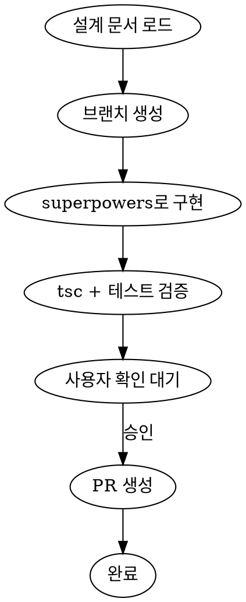

# Implement Plan

설계 문서를 기반으로 구현 → 사용자 확인 → PR 생성까지 한 세션에서 처리한다.



## Step 1: 설계 문서 로드

설계 문서의 구조는 [`docs/rules/plan-writing-guide.md`](../../../docs/rules/plan-writing-guide.md) 를 따른다. **먼저 이 가이드를 Read 하여** 설계 문서가 가져야 할 섹션 이름을 확인한 뒤 문서를 파싱한다. 가이드가 개정되면 파싱 규칙도 자동으로 따라가게 하기 위함이다.

1. 사용자가 지정한 `docs/plans/` 문서를 읽는다.
2. 가이드의 섹션 규약에 따라 다음을 추출한다:
   - **배경** — 왜 이 작업이 필요한지
   - **설계 규칙** — 작업 중 지켜야 할 원칙 (Step 2 구현 시 준수)
   - **성공 기준 (Definition of Done)** — 전체 작업의 완료 조건 (Step 3 의 DoD 체크리스트로 사용)
   - **Phase 목록** — 각 Phase 의 `입력` / `작업 내용` (`- [ ]` 체크리스트) / `완료 조건`
   - **Phase 내 `#### 수동 검증` 항목** — Step 3 의 수동 확인 항목으로 그대로 사용
3. **브랜치명**은 가이드 규약 대상이 아니므로 문서 상단 메타 영역이나 제목에서 찾는다. 없으면 사용자에게 물어본다.
4. 확정된 브랜치명으로 브랜치를 생성한다.

## Step 2: 구현

**REQUIRED SUB-SKILL:** `superpowers:executing-plans` 를 사용하여 설계 문서의 작업 항목을 순차 실행한다.

### 각 작업 항목마다

1. **작업 시작 전** — `convention-frontend` 스킬을 호출하여, 해당 작업이 건드리는 영역(`typescript` / `component-structure` / `feature-public-api` / `global-state-boundary` / `folder-structure`)에 해당하는 규칙 문서를 읽는다. 작업마다 영역이 다를 수 있으므로 **매 항목마다 반복** 호출한다.
2. **코드 수정** — 읽은 규칙을 따라 구현한다.
3. **자기 검증 보고** — 적용한 규칙을 한 줄로 메모한다 (예: `typescript/README.md 의 배열 표기 규칙 적용`).

### 모든 작업 항목 완료 후: 검증

`superpowers:verification-before-completion` 스킬을 호출하여 "구현 완료" 를 주장하기 전 최종 검증을 수행한다. 이 게이트를 통과하지 못하면 Step 3 으로 넘어가지 않는다.

flowchart 상 "tsc + 테스트 검증" 단계에 해당하며, 다음 명령을 순서대로 실행한다 (이 프로젝트는 pnpm 사용):

- **타입 체크**: `pnpm exec tsc --noEmit`
  - 이 프로젝트는 `tsc` 전용 스크립트가 없으므로 `exec` 로 직접 호출한다.
- **테스트**: `pnpm test -- --watchAll=false`
  - `pnpm test` 단독 호출은 react-scripts 의 watch 모드로 들어가 세션이 멈춘다. 반드시 `--watchAll=false` 를 붙여 1회 실행 모드로 돌린다.
  - 테스트 파일이 전혀 없으면 "No tests found" 를 반환하는데, 이는 실패로 간주하지 않는다.

결과 기록:
- 각 명령의 통과 여부와 실패 내용을 메모한다. Step 3 의 "구현 결과 보고" 표에 그대로 옮긴다.
- 하나라도 실패하면 해결한 뒤 **전체를 재실행** 한다. 실패를 해결하지 않고 Step 3 으로 넘어가지 않는다.

## Step 3: 사용자 확인 대기

구현 완료 후 다음을 출력하고 **사용자 승인을 기다린다:**

### 구현 결과 보고

| 항목 | 내용 |
|------|------|
| **변경 파일** | 생성/수정/삭제된 파일 목록 |
| **DoD 체크리스트** | 설계 문서의 성공 기준 각 항목별 ✅/❌ |
| **`pnpm exec tsc --noEmit`** | 통과 여부 (에러 있으면 내용 포함) |
| **`pnpm test -- --watchAll=false`** | 통과 여부 (실패 있으면 기존 이슈인지 구분, "No tests found" 는 통과 취급) |

### 사용자 확인 가이드

사용자가 무엇을 확인해야 하는지 구체적으로 안내한다:

```
## 확인 부탁드립니다

### 수동 확인 항목
- [ ] {설계 문서 Phase 섹션의 `#### 수동 검증` 항목을 그대로 나열}

### 확인 포인트
- 변경된 파일이 설계 문서의 After 구조와 일치하는지
- 기존 동작이 깨지지 않았는지 (화면에서 직접 확인)
- 의도하지 않은 파일이 변경되지 않았는지

확인 후 "ㅇㅇ" 하시면 PR을 생성합니다.
수정이 필요하면 말씀해주세요.
```

## Step 4: PR 생성

사용자가 승인하면 `worker-create-pr` 스킬을 사용하여 PR을 생성한다.

생성된 PR URL을 사용자에게 출력한다.
