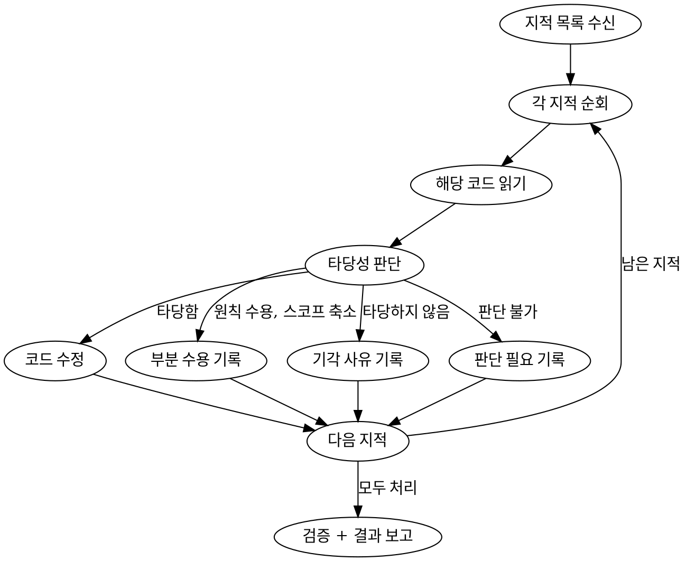

# Resolve Review

지적 목록을 받아 각 항목의 타당성을 판단하고, 타당한 것은 수정, 타당하지 않은 것은 기각한다.

## 입력 소스

독립 실행이든 루프 실행이든 동일한 방식으로 `gh api`를 통해 review comment를 수집한다.

## 최우선 원칙: 기능 보존

어떤 수정도 기존 동작을 변경하거나 깨뜨려서는 절대 안 된다.
수정 전 해당 함수/컴포넌트의 사용처를 grep으로 확인하고, 반환값/props/시그니처 변경이 있으면 수정하지 않는다.



## Step 0: PR 메타 수집

이후 단계에서 참조할 PR 메타 정보를 수집한다.

```bash
# baseRef (보통 master) — 회귀성 지적 대조에 사용
baseRef=$(gh pr view <PR_NUMBER> --json baseRefName --jq '.baseRefName')
```

`baseRef` 는 Step 2 의 회귀성 지적 판별 박스와 Step 5 의 `Before:` 필드 작성 시 참조한다.

## Step 1: 지적 목록 수집

`gh api`로 가장 최근 `CHANGES_REQUESTED` review의 comment 목록을 수집한다.

```bash
# 가장 최근 review의 ID 가져오기
gh api repos/{owner}/{repo}/pulls/{pr}/reviews \
  --jq 'map(select(.state == "CHANGES_REQUESTED")) | last | .id'

# 해당 review의 comment 목록
gh api repos/{owner}/{repo}/pulls/{pr}/comments \
  --jq '[.[] | select(.pull_request_review_id == REVIEW_ID) | {id, path, line, body}]'
```

각 comment의 `body`에서 심각도, 제목, 내용, Basis, Suggest를 파싱한다.

## Step 2: 각 지적 타당성 판단

각 지적마다 **해당 파일의 실제 코드를 읽고** 타당성을 판단한다.
**심각도와 무관하게 모든 항목(Must Fix, Should Fix, Suggestion)을 독립적으로 판단한다.**
리뷰어가 🟢 Suggestion으로 표기했더라도 실제로 개선 가치가 있다고 판단되면 수정한다.
반대로 🔴 Must Fix라도 타당하지 않으면 기각한다. 심각도 라벨이 아닌 기술적 판단이 기준이다.

### 수정한다 (✅ 수정)

- 실제 버그이거나 런타임 문제를 유발하는 경우
- 프로젝트 컨벤션(`docs/rules/`)에 명시적으로 위반하는 경우
- 설계 문서의 성공 기준(DoD)을 충족하지 못하는 경우
- 불필요한 코드가 실제로 존재하는 경우
- 리렌더/성능 문제가 실측 가능한 수준인 경우

### 부분 수용 (🟨 부분 수용)

- 리뷰어가 제시한 원칙·근거는 타당하다
- 그러나 적용 범위(N개 지점)를 이번 PR 스코프 내에서 축소(M개, M < N)하여 반영한다
- 유예된 (N - M)개는 **반드시 후속 티켓 또는 이슈 번호와 함께** 유예 사유를 명시한다

전형적인 사유:
- 나머지 지점은 다른 기능 영역의 리스크가 있어 별도 PR 로 분리
- 본 PR 스코프(Phase N) 밖의 파일
- 리그레션 검증 비용이 커서 이번 라운드에서 전부 검증 어려움

**주의:** "원칙은 받아들이되 일부만 적용" 패턴이 나타나면 `수정`이 아니라 반드시 `부분 수용`으로 분류한다. 카운트 왜곡을 막기 위한 핵심 규칙이다.

### 기각한다 (❌ 기각)

- 리뷰어가 코드를 잘못 읽었거나 컨텍스트를 놓친 경우
- 취향 차이이며 현재 코드도 컨벤션에 부합하는 경우
- 수정 시 오히려 복잡성이 증가하는 경우
- 설계 문서의 Out of scope에 해당하는 경우
- 과도한 최적화 (측정 가능한 성능 차이 없음)

### 판단 불가 (❓ 판단 필요)

- 사용자에게 판단을 위임한다
- 양쪽 논거를 함께 제시한다

### 회귀성 지적 판별

다음 중 하나라도 맞으면 "회귀성 지적"으로 판정한다:

1. 지적 본문에 키워드 중 하나 등장: `회귀`, `원래`, `기존`, `이전`, `regression`
2. Basis 필드가 설계 문서 DoD 중 회귀 관련 항목을 인용: `회귀 없음`, `외관 차이 없음`, `기존 동작 보존`, `시각적 차이가 없다` 류

회귀성으로 판정되면:

- 수정 전 반드시 base branch 원본을 확인한다:
  ```bash
  git show <baseRef>:<path>
  ```
- 해당 확인 결과를 Step 5 reply 의 `Before:` 필드에 발췌(2~6줄)하여 포함한다
- 대조 없이 리뷰어 주장만 신뢰하여 수정하지 않는다

`<baseRef>` 는 Step 0 에서 수집한 값.

## Step 3: 수정 실행

타당한 지적에 대해:
1. 해당 파일:라인의 코드를 수정한다
2. 리뷰 제안 코드가 있으면 참고하되, 그대로 복사하지 않고 컨텍스트에 맞게 적용한다
3. 수정이 다른 코드에 영향을 주는지 확인한다

## Step 4: 검증

```bash
pnpm exec tsc --noEmit
```

## Step 5: Reply + 커밋 + 요약 코멘트

### 각 review comment에 reply

각 지적에 대한 처리 결과를 해당 review comment 스레드에 reply로 남긴다.

**수정:**
```
✅ 수정

{수정 내용 요약}

커밋: `{hash}`
```

**수정 (회귀성 지적인 경우 — Step 2 판별 박스 참조):**
````
✅ 수정

{수정 내용 요약}

**Before** (`git show <baseRef>:<path>` 발췌):
```diff
{원본 코드 2~6줄}
```

커밋: `{hash}`
````

**부분 수용:**
```
🟨 부분 수용

**적용 범위:** {이 PR 에서 고친 지점 목록}
**유예 범위:** {같은 원칙이 적용되지만 이번엔 안 고친 지점 목록}
**사유:** {유예 사유 — 스코프/리스크/기능 경계}
**후속 티켓:** {이슈 번호 또는 "TBD — 이번 Round 종료 후 생성"}

커밋: `{hash}`
```

**기각:**
```
❌ 기각

**Reason:** {기각 사유 + 출처}
```

**판단 필요:**
```
❓ 판단 필요

- 수정 근거: ...
- 유지 근거: ...
```

```bash
gh api repos/{owner}/{repo}/pulls/{pr}/comments/{comment_id}/replies \
  --method POST \
  -f body="✅ 수정 — ..."
```

### 커밋

수정이 있으면 커밋한다 (amend 하지 않음).

### 요약 코멘트

라운드 번호는 PR의 기존 `## 🔧 Resolve Round` 코멘트 수를 세어 결정한다.

```bash
gh pr comment <PR_NUMBER> --body "$(cat <<'EOF'
## 🔧 Resolve Round N

**요약:** ✅ 수정 a · 🟨 부분 수용 b · ❌ 기각 c · ❓ 판단 필요 d · Must Fix 잔여 e
EOF
)"
```

## Step 6: 결과 반환

처리 결과를 요약하여 반환한다:

```
수정: N건, 부분 수용: N건, 기각: N건, 판단 필요: N건, Must Fix 잔여: N건
```

## 독립 실행 경로

"리뷰 반영해" 입력 시:
1. Step 0~5를 실행하여 PR에 코멘트를 남긴다
2. 사용자에게 처리 결과를 요약하여 보고한다
3. 기각/판단필요 항목에 대해 사용자 피드백을 기다린다
