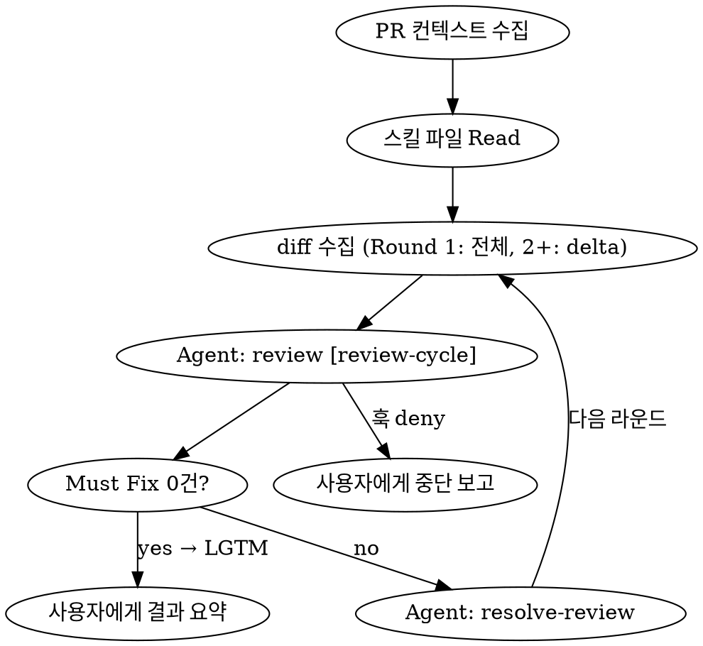

# 리뷰 루프 재설계: 스킬 분리 + 훅 기반 사이클 제한

> 참조 문서: [`docs/plans/2026-04-10-review-loop-redesign.md`](2026-04-10-review-loop-redesign.md)

## 배경 (Why)

현재 `review-implementation` 스킬은 리뷰와 수정을 하나의 스킬 안에서 처리하며, 사이클 제한이 프롬프트 기반(LLM이 `roundCount`를 추적)이라 신뢰성이 낮다. 또한 리뷰만 따로, 수정만 따로 실행할 수 없는 구조다.

### 목표

1. 리뷰 / 수정을 독립 스킬로 분리하여 개별 실행 가능하게
2. 오케스트레이터가 두 스킬을 서브에이전트로 호출하는 루프 구조
3. 사이클 제한을 PreToolUse 훅으로 하드 리밋 — LLM 의존 제거

## 설계 규칙

- 기능 보존 최우선: 리뷰/수정 전 과정에서 기존 동작 손상 금지
- 각 스킬은 독립 실행 가능해야 한다
- 오케스트레이터는 루프 제어만 담당, 직접 리뷰/수정하지 않음
- 서브에이전트에 스킬 내용을 프롬프트로 주입 (Skill 도구 호출에 의존하지 않음)
- 사이클 카운팅은 훅이 전담, 오케스트레이터는 카운팅하지 않음

## 성공 기준 (DoD)

- [ ] `review` 스킬: 독립 실행 시 PR 리뷰 + PR 코멘트 작성
- [ ] `resolve-review` 스킬: 독립 실행 시 지적 목록 기반 타당성 판단 + 수정/기각 + PR 코멘트 작성
- [ ] `review-loop` 스킬: 두 스킬을 서브에이전트로 루프 실행
- [ ] `review-cycle-limit.mjs` 훅: `[review-cycle]` 마커 Agent 호출을 5회로 제한
- [ ] `agent-limit.mjs` 삭제
- [ ] `review-implementation` 스킬 삭제
- [ ] 각 라운드마다 review, resolve 각각 PR에 코멘트를 남김

## 최종 구조

### Before

```
.claude/skills/
├── review-implementation/SKILL.md  ← 리뷰+수정 통합, 프롬프트 기반 카운팅
├── resolve-review/SKILL.md         ← 외부 리뷰어 코멘트 처리 (수동용)

.claude/hooks/
├── agent-limit.mjs                 ← 전체 Agent 호출 무차별 카운팅 (15회)
```

### After

```
.claude/skills/
├── review/SKILL.md                 ← NEW: 순수 리뷰
├── resolve-review/SKILL.md         ← REWRITE: 타당성 판단 + 수정/댓글
├── review-loop/SKILL.md            ← NEW: 오케스트레이터

.claude/hooks/
├── review-cycle-limit.mjs          ← NEW: [review-cycle] 마커 전용 카운팅
```

### 역할 분리

| 스킬 | 입력 | 출력 | PR 코멘트 | 독립 실행 |
|------|------|------|-----------|-----------|
| `review` | PR diff + 설계문서 | 지적 목록 (🔴/🟡/🟢) | `## 🔍 Review Round N` | O — "PR #N 리뷰해" |
| `resolve-review` | 지적 목록 + 실제 코드 | 수정/기각/판단필요 | `## ✅ Resolve Round N` | O — "리뷰 반영해" |
| `review-loop` | PR 번호 | 사용자에게 결과 요약 | 각 서브에이전트가 남김 | 진입점 — "PR #N 리뷰 루프" |

---

## Phase 1: `review` 스킬 신규 작성

### 입력 (선행 조건)

- 없음 (첫 번째 Phase)

### 작업 내용

- [ ] `.claude/skills/review/SKILL.md` 작성

#### 스킬 명세

```yaml
name: review-implementation
description: >
  Use when a PR has been created and needs code review.
  Trigger on "리뷰 해줘", "코드 리뷰", "PR 리뷰", "PR #N 리뷰 해줘".
```

**핵심 동작:**

1. PR 컨텍스트 수집
   ```bash
   gh pr view <PR_NUMBER> --json number,title,body,baseRefName,headRefName
   gh pr diff <PR_NUMBER>
   ```
2. PR body 또는 브랜치명에서 `docs/plans/`의 관련 설계 문서 탐색 → DoD 추출
3. 변경된 각 파일을 읽고 리뷰 기준에 따라 지적 목록 생성
4. PR에 코멘트 작성
5. **결과를 정해진 형식으로 반환** (오케스트레이터가 파싱할 수 있도록)

**리뷰 기준** (기존 `review-implementation`에서 이관):

- 최우선 원칙: 기능 보존 — 수정 제안이 기존 동작을 변경할 가능성 있으면 🔴로 지적하지 않음
- 설계 문서 준수: DoD 충족, After 구조 일치, Out of scope 미침범
- 프로젝트 아키텍처: `docs/rules/` 기준
- TypeScript 컨벤션: `docs/rules/typescript/README.md` 기준
- React 클린코드: 불필요한 리렌더, derived state, composition 패턴
- 코드 품질: DRY, YAGNI, registry 패턴

**PR 코멘트 형식:**

```markdown
## 🔍 Review Round N

| # | 심각도 | 파일:라인 | 문제 | 수정 제안 |
|---|--------|-----------|------|-----------|
| 1 | 🔴 Must Fix | `src/foo.ts:42` | Array<T> 미적용 | `items: Array<string>` |
| 2 | 🟡 Should Fix | `src/bar.tsx:8` | 불필요한 리렌더 | useMemo 적용 |
```

LGTM인 경우:
```markdown
## 🔍 Review Round N

LGTM — 지적 사항 없음
```

**반환 형식:**

- 지적 있음: 지적 목록 텍스트 (오케스트레이터가 resolve에 전달)
- 지적 없음: 문자열 `"LGTM"`

### 완료 조건

- [ ] `.claude/skills/review/SKILL.md` 파일이 존재한다
- [ ] 스킬에 리뷰 기준, PR 코멘트 형식, 반환 형식이 모두 명시되어 있다
- [ ] 독립 실행 경로: "PR #N 리뷰해" 입력 시 PR 코멘트가 남는 흐름이 문서에 기술되어 있다

#### 수동 검증

- [ ] "PR #N 리뷰해" 실행 → PR에 `## 🔍 Review Round N` 코멘트가 남는다
- [ ] 지적 0건일 때 "LGTM" 반환 확인

---

## Phase 2: `resolve-review` 스킬 리라이트

### 입력 (선행 조건)

- Phase 1 완료 (review 스킬의 출력 형식을 입력으로 받으므로)

### 작업 내용

- [ ] `.claude/skills/resolve-review/SKILL.md` 리라이트

#### 변경 포인트 (기존 대비)

| 항목 | 기존 | 변경 |
|------|------|------|
| 입력 소스 | PR에 달린 외부 리뷰어 코멘트 (`gh pr view --comments`) | review 스킬의 지적 목록 (프롬프트로 주입) |
| PR 코멘트 형식 | `## Review Resolution` (단일 테이블) | `## ✅ Resolve Round N` (라운드별) |
| 독립 실행 | PR 코멘트 기반 | PR 코멘트 기반 (유지) |
| 루프 실행 | 해당 없음 | 오케스트레이터가 지적 목록을 프롬프트로 전달 |

**핵심 동작:**

1. 지적 목록 수신 (독립 실행: PR 코멘트에서 수집 / 루프: 프롬프트로 주입)
2. 각 지적마다 해당 파일의 실제 코드를 읽고 타당성 판단
3. 타당한 지적: 코드 수정 + `✅ 수정` 기록
4. 타당하지 않은 지적: `❌ 기각` + 사유 기록
5. 판단 불가: `❓ 판단 필요` + 양쪽 논거
6. `pnpm exec tsc --noEmit` 검증
7. 수정이 있으면 커밋 (amend 하지 않음)
8. PR에 코멘트 작성

**타당성 판단 기준** (기존 유지):

- 수정: 실제 버그, 컨벤션 위반, DoD 미충족, 불필요 코드, 실측 가능 성능 문제
- 기각: 코드 오독, 취향 차이, 복잡성 증가, Out of scope, 과도한 최적화
- 판단 불가: 사용자에게 위임 + 양쪽 논거 제시

**PR 코멘트 형식:**

```markdown
## ✅ Resolve Round N

| # | 파일:라인 | 리뷰 내용 | 판단 | 사유 |
|---|-----------|-----------|------|------|
| 1 | `src/foo.ts:42` | Array<T> 미적용 | ✅ 수정 | 컨벤션 위반, 수정 완료 |
| 2 | `src/bar.tsx:8` | 불필요한 리렌더 | ❌ 기각 | 복잡성 증가, 측정 가능한 성능 차이 없음 |

**요약:** 수정 1건, 기각 1건, 판단 필요 0건, Must Fix 잔여 0건
```

### 완료 조건

- [ ] `.claude/skills/resolve-review/SKILL.md`가 리라이트되었다
- [ ] 입력 소스: PR 코멘트 기반(독립) + 프롬프트 주입(루프) 양쪽 모두 지원한다
- [ ] PR 코멘트 형식이 `## ✅ Resolve Round N` 형태다
- [ ] 기존 타당성 판단 기준이 유지되었다

#### 수동 검증

- [ ] "리뷰 반영해" 실행 → PR에 `## ✅ Resolve Round N` 코멘트가 남는다
- [ ] 수정된 파일이 커밋된다 (amend 아님)

---

## Phase 3: `review-cycle-limit.mjs` 훅 작성

### 입력 (선행 조건)

- 없음 (Phase 1, 2와 독립 — 훅은 스킬 내용과 무관하게 Agent 호출을 카운팅)

### 작업 내용

- [ ] `.claude/hooks/review-cycle-limit.mjs` 작성
- [ ] `.claude/settings.local.json`에 훅 등록

#### 훅 명세

```
트리거: PreToolUse → Agent
조건: tool_input.description에 "[review-cycle]" 포함
동작: 세션별 카운터 파일에 +1, 5 초과 시 deny
카운터 파일: {tmpdir}/claude-review-cycle-{session_id}
```

**카운팅 규칙:**

| Agent 호출 | description 예시 | 카운트 |
|------------|------------------|--------|
| review 서브에이전트 | `[review-cycle] PR #N 리뷰` | +1 |
| resolve 서브에이전트 | `PR #N 리뷰 반영` | 무시 |
| 일반 Agent (탐색 등) | `파일 구조 탐색` | 무시 |

**카운터 파일 구조:**

```json
{
  "cycleCount": 3,
  "sameCycleStreak": 0
}
```

**카운팅 로직:**

```
매 Agent 호출 시:
  if description에 "[review-cycle]" 포함:
    cycleCount++
    sameCycleStreak = 0      ← 카운트가 진행됨, 리셋
  else:
    sameCycleStreak++         ← 카운트 변동 없이 Agent 호출됨

deny 조건:
  1) cycleCount > 5          ← 사이클 상한
  2) sameCycleStreak >= 4    ← 카운트 정체 감지 (비정상 루프)
```

**deny 메시지 (조건 1 — 사이클 상한):**
```
리뷰 사이클 N회 도달 (최대 5회).
현재까지의 리뷰 히스토리(라운드별 요약, 잔여 Must Fix, 미해결 사유)를 사용자에게 즉시 보고하세요.
```

**deny 메시지 (조건 2 — 정체 감지):**
```
동일 사이클 카운트(N회)에서 Agent가 4회 연속 호출되었습니다.
카운트가 진행되지 않는 비정상 루프로 판단하여 차단합니다.
현재까지의 리뷰 히스토리를 사용자에게 즉시 보고하세요.
```

#### settings.local.json 훅 등록

```jsonc
{
  "hooks": {
    "PreToolUse": [
      {
        "matcher": "Agent",
        "hooks": [".claude/hooks/review-cycle-limit.mjs"]
      }
    ]
  }
}
```

### 완료 조건

- [ ] `.claude/hooks/review-cycle-limit.mjs` 파일이 존재한다
- [ ] `.claude/settings.local.json`의 `hooks.PreToolUse`에 등록되었다
- [ ] `[review-cycle]` 마커가 있는 Agent 호출만 카운팅한다
- [ ] `cycleCount > 5` 또는 `sameCycleStreak >= 4`일 때 deny한다

#### 수동 검증

- [ ] `[review-cycle]` 마커 있는 Agent 호출 → 카운터 파일에 cycleCount 증가
- [ ] 마커 없는 Agent 호출 → cycleCount 불변, sameCycleStreak 증가
- [ ] 6번째 `[review-cycle]` Agent 호출 → deny + 메시지 출력
- [ ] sameCycleStreak 4회 도달 → deny + 메시지 출력

---

## Phase 4: `review-loop` 오케스트레이터 스킬 작성

### 입력 (선행 조건)

- Phase 1 완료 (`review` 스킬 존재)
- Phase 2 완료 (`resolve-review` 스킬 리라이트 완료)
- Phase 3 완료 (`review-cycle-limit.mjs` 훅 등록)

### 작업 내용

- [ ] `.claude/skills/review-loop/SKILL.md` 작성

#### 스킬 명세

```yaml
name: review-loop
description: >
  Use when a PR needs automated review-fix loop.
  Trigger on "PR #N 리뷰 루프", "리뷰 루프 돌려줘".
```

#### 오케스트레이터 흐름



**Step 1: PR 컨텍스트 수집**

```bash
gh pr view <PR_NUMBER> --json number,title,body,baseRefName,headRefName
gh pr diff <PR_NUMBER> --name-only
```

- PR body 또는 브랜치명에서 `docs/plans/`의 관련 설계 문서 탐색
- 해당 브랜치 checkout

**Step 2: 스킬 파일 Read**

```
Read .claude/skills/review/SKILL.md → reviewSkillContent
Read .claude/skills/resolve-review/SKILL.md → resolveSkillContent
```

**Step 3: 루프**

```
round = 1
loop:
  // diff 수집 — 매 라운드마다 최신 상태 반영
  if round == 1:
    diff = gh pr diff <PR_NUMBER>              // 전체 PR diff
  else:
    diff = git diff HEAD~1                     // 직전 resolve가 수정한 delta만

  // 리뷰 — 훅이 카운팅
  reviewResult = Agent(
    description="[review-cycle] PR #N 리뷰",
    prompt=reviewSkillContent + PR메타정보 + diff
  )

  if reviewResult == "LGTM":
    break → Step 4

  // 수정 — 훅이 카운팅하지 않음
  resolveResult = Agent(
    description="PR #N 리뷰 반영",
    prompt=resolveSkillContent + reviewResult
  )

  round++
  라운드 기록 누적
```

**diff 전략:**
- **Round 1**: 전체 PR diff — PR의 모든 변경사항을 리뷰
- **Round 2+**: resolve가 수정한 delta만 — 이미 리뷰를 통과한 코드는 다시 보지 않음

**루프 탈출 조건:**
1. Must Fix 0건 (정상 종료) — 리뷰 서브에이전트가 "LGTM" 반환
2. 훅 deny (강제 종료) — 5사이클 도달, 오케스트레이터가 중단 보고로 전환

**Step 4: 사용자에게 결과 요약**

```
리뷰 완료: PR #N

- 총 N라운드 실행
- 수정: N건, 기각: N건, 판단 필요: N건
- 각 라운드 히스토리는 PR 코멘트에 기록되어 있습니다

{판단 필요 항목이 있으면}
아래 항목은 사용자 판단이 필요합니다:
- `파일:라인` — 양쪽 논거

{기각 항목이 있으면}
아래 항목은 기각했습니다 (사유 확인 부탁드립니다):
- `파일:라인` — 기각 사유
```

**PR 타임라인 예시:**

```
🔍 Review Round 1        ← review 서브에이전트
✅ Resolve Round 1        ← resolve 서브에이전트
🔍 Review Round 2 (LGTM) ← review 서브에이전트 (루프 종료)
```

### 완료 조건

- [ ] `.claude/skills/review-loop/SKILL.md` 파일이 존재한다
- [ ] 스킬이 review, resolve 스킬 파일을 Read하여 프롬프트로 주입한다
- [ ] Round 1은 전체 diff, Round 2+는 delta만 사용한다
- [ ] 오케스트레이터는 직접 리뷰/수정하지 않고 루프 제어만 한다
- [ ] 훅 deny 시 중단 보고로 전환하는 흐름이 기술되어 있다

#### 수동 검증

- [ ] "PR #N 리뷰 루프" 실행 → 리뷰 → 수정 → 재리뷰 루프가 돌아간다
- [ ] 각 라운드마다 PR에 🔍 Review / ✅ Resolve 코멘트가 순서대로 남는다
- [ ] LGTM 시 루프 정상 종료 + 결과 요약 출력
- [ ] 5사이클 도달 시 훅 deny → 오케스트레이터가 중단 보고

---

## Phase 5: 정리 (기존 스킬/훅 삭제)

### 입력 (선행 조건)

- Phase 1~4 모두 완료
- Phase 4 수동 검증 통과

### 작업 내용

- [ ] `.claude/skills/review-implementation/` 디렉토리 삭제
- [ ] `.claude/hooks/agent-limit.mjs` 삭제 (현재 파일 없음 — 확인 후 스킵 가능)
- [ ] `.claude/settings.local.json`에서 `agent-limit.mjs` 관련 설정 제거 (있는 경우)

### 완료 조건

- [ ] `review-implementation` 디렉토리가 존재하지 않는다
- [ ] `agent-limit.mjs` 파일이 존재하지 않는다
- [ ] settings에 삭제된 훅 참조가 남아있지 않다

#### 수동 검증

- [ ] 기존 "PR #N 리뷰 해줘" 트리거 → `review` 스킬이 실행된다 (review-implementation이 아님)
- [ ] 일반 Agent 호출(탐색 등) → 차단 없이 정상 동작한다

---

## Out of Scope

- 설계 문서 자체의 품질 검증
- 테스트 코드 커버리지
- 기존 코드의 문제 (이번 PR에서 변경하지 않은 코드)
- 리뷰 기준 자체의 수정 (별도 피드백 프로세스)
