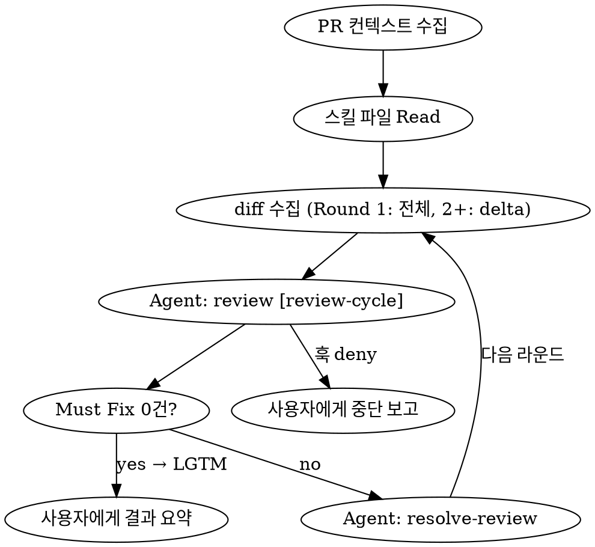

# 리뷰 루프 재설계: 스킬 분리 + 훅 기반 사이클 제한

## 배경 (Why)

현재 `review-implementation` 스킬은 리뷰와 수정을 하나의 스킬 안에서 처리하며, 사이클 제한이 프롬프트 기반(LLM이 roundCount를 추적)이라 신뢰성이 낮다. 또한 리뷰만 따로, 수정만 따로 실행할 수 없는 구조다.

### 목표

1. 리뷰 / 수정을 독립 스킬로 분리하여 개별 실행 가능하게
2. 오케스트레이터가 두 스킬을 서브에이전트로 호출하는 루프 구조
3. 사이클 제한을 PreToolUse 훅으로 하드 리밋 — LLM 의존 제거

## 설계 규칙

- 기능 보존 최우선: 리뷰/수정 전 과정에서 기존 동작 손상 금지
- 각 스킬은 독립 실행 가능해야 한다
- 오케스트레이터는 루프 제어만 담당, 직접 리뷰/수정하지 않음
- 서브에이전트에 스킬 내용을 프롬프트로 주입 (Skill 도구 호출에 의존하지 않음)
- 사이클 카운팅은 훅이 전담, 오케스트레이터는 카운팅하지 않음

## 성공 기준 (DoD)

- [ ] `review` 스킬: 독립 실행 시 PR 리뷰 + PR 코멘트 작성
- [ ] `resolve-review` 스킬: 독립 실행 시 지적 목록 기반 타당성 판단 + 수정/기각 + PR 코멘트 작성
- [ ] `review-loop` 스킬: 두 스킬을 서브에이전트로 루프 실행
- [ ] `review-cycle-limit.mjs` 훅: `[review-cycle]` 마커 Agent 호출을 5회로 제한
- [ ] `agent-limit.mjs` 삭제
- [ ] 각 라운드마다 review, resolve 각각 PR에 코멘트를 남김

---

## Phase 1: 스킬 구조

### Before

```
.claude/skills/
├── review-implementation/SKILL.md  ← 리뷰+수정 통합, 프롬프트 기반 카운팅
├── resolve-review/SKILL.md         ← 외부 리뷰어 코멘트 처리 (수동용)

.claude/hooks/
├── agent-limit.mjs                 ← 전체 Agent 호출 무차별 카운팅 (15회)
```

### After

```
.claude/skills/
├── review/SKILL.md                 ← NEW: 순수 리뷰
├── resolve-review/SKILL.md         ← REWRITE: 타당성 판단 + 수정/댓글
├── review-loop/SKILL.md            ← NEW: 오케스트레이터
├── review-implementation/          ← DELETE

.claude/hooks/
├── review-cycle-limit.mjs          ← NEW: [review-cycle] 마커 전용 카운팅
├── agent-limit.mjs                 ← DELETE
```

### 역할 분리

| 스킬 | 입력 | 출력 | PR 코멘트 | 독립 실행 |
|------|------|------|-----------|-----------|
| `review` | PR diff + 설계문서 | 지적 목록 (🔴/🟡/🟢) | `## 🔍 Review` | O — "PR #N 리뷰해" |
| `resolve-review` | 지적 목록 + 실제 코드 | 수정/기각/판단필요 | `## ✅ Resolve` | O — "리뷰 반영해" |
| `review-loop` | PR 번호 | 사용자에게 결과 요약 | 각 서브에이전트가 남김 | 진입점 — "PR #N 리뷰 루프" |

---

## Phase 2: 훅 설계

### review-cycle-limit.mjs

```
트리거: PreToolUse → Agent
조건: tool_input.description에 "[review-cycle]" 포함
동작: 세션별 카운터 파일에 +1, 5 초과 시 deny
카운터 파일: {tmpdir}/claude-review-cycle-{session_id}
```

**카운팅 규칙:**

| Agent 호출 | description | 카운트 |
|------------|-------------|--------|
| review 서브에이전트 | `[review-cycle] PR #N 리뷰` | +1 |
| resolve 서브에이전트 | `PR #N 리뷰 반영` | 무시 |
| 일반 Agent (탐색 등) | `파일 구조 탐색` | 무시 |

**deny 시 메시지:**
```
리뷰 사이클 N회 도달 (최대 5회).
현재까지의 리뷰 히스토리(라운드별 요약, 잔여 Must Fix, 미해결 사유)를 사용자에게 즉시 보고하세요.
```

### 안전장치: 동일 카운트 반복 감지

사이클 카운트가 증가하지 않는데 Agent 호출이 계속되는 경우 — 즉 `[review-cycle]` 마커 없이 Agent가 반복 호출되어 카운트가 동일하게 유지되는 상황 — 을 감지한다.

**시나리오:** 카운트가 3인 채로 resolve나 기타 Agent가 계속 호출됨 → 마커가 없으니 카운트는 3 그대로 → 루프는 계속 돌지만 훅은 차단하지 못함

**해결:** 훅이 매 Agent 호출마다 실행되므로, 카운터 파일에 `cycleCount`와 `sameCycleStreak`을 함께 기록한다.

```
매 Agent 호출 시:
  if description에 "[review-cycle]" 포함:
    cycleCount++
    sameCycleStreak = 0      ← 카운트가 진행됨, 리셋
  else:
    sameCycleStreak++         ← 카운트 변동 없이 Agent 호출됨

deny 조건:
  1) cycleCount > 5          ← 기존: 사이클 상한
  2) sameCycleStreak >= 4    ← 신규: 카운트 정체 감지
```

**deny 시 메시지 (조건 2):**
```
동일 사이클 카운트(N회)에서 Agent가 4회 연속 호출되었습니다.
카운트가 진행되지 않는 비정상 루프로 판단하여 차단합니다.
현재까지의 리뷰 히스토리를 사용자에게 즉시 보고하세요.
```

### agent-limit.mjs → 삭제

리뷰 사이클은 `review-cycle-limit.mjs`가 정밀 제한하고(사이클 상한 + 정체 감지), 일반 Agent 호출을 제한할 이유가 없으므로 삭제한다.

---

## Phase 3: 오케스트레이터 흐름 (review-loop)



### Step 1: PR 컨텍스트 수집

```bash
gh pr view <PR_NUMBER> --json number,title,body,baseRefName,headRefName
gh pr diff <PR_NUMBER> --name-only
```

- PR body 또는 브랜치명에서 `docs/plans/`의 관련 설계 문서 탐색
- 해당 브랜치 checkout

### Step 2: 스킬 파일 Read

```
Read .claude/skills/review/SKILL.md → reviewSkillContent
Read .claude/skills/resolve-review/SKILL.md → resolveSkillContent
```

### Step 3: 루프

```
round = 1
loop:
  // diff 수집 — 매 라운드마다 최신 상태 반영
  if round == 1:
    diff = gh pr diff <PR_NUMBER>              // 전체 PR diff
  else:
    diff = git diff HEAD~1                     // 직전 resolve가 수정한 delta만

  // 리뷰 — 훅이 카운팅
  reviewResult = Agent(
    description="[review-cycle] PR #N 리뷰",
    prompt=reviewSkillContent + PR메타정보 + diff
  )

  if reviewResult == "LGTM":
    break → Step 4

  // 수정 — 훅이 카운팅하지 않음
  resolveResult = Agent(
    description="PR #N 리뷰 반영",
    prompt=resolveSkillContent + reviewResult
  )

  round++
  라운드 기록 누적
```

**diff 전략:**
- **Round 1**: 전체 PR diff — PR의 모든 변경사항을 리뷰
- **Round 2+**: resolve가 수정한 delta만 — 이미 리뷰를 통과한 코드는 다시 보지 않음

**루프 탈출 조건:**
1. Must Fix 0건 (정상 종료) — 리뷰 서브에이전트가 "LGTM" 반환
2. 훅 deny (강제 종료) — 5사이클 도달, 오케스트레이터가 중단 보고로 전환

### Step 4: 사용자에게 결과 요약

```
리뷰 완료: PR #N

- 총 N라운드 실행
- 수정: N건, 기각: N건, 판단 필요: N건
- 각 라운드 히스토리는 PR 코멘트에 기록되어 있습니다

{판단 필요 항목이 있으면}
아래 항목은 사용자 판단이 필요합니다:
- `파일:라인` — 양쪽 논거

{기각 항목이 있으면}
아래 항목은 기각했습니다 (사유 확인 부탁드립니다):
- `파일:라인` — 기각 사유
```

---

## Phase 4: PR 코멘트 전략

각 서브에이전트가 **자기 작업 완료 시 즉시** PR에 코멘트를 남긴다. 오케스트레이터는 최종 요약을 남기지 않는다.

### review 서브에이전트 코멘트 형식

```markdown
## 🔍 Review Round N

| # | 심각도 | 파일:라인 | 문제 | 수정 제안 |
|---|--------|-----------|------|-----------|
| 1 | 🔴 Must Fix | `src/foo.ts:42` | Array<T> 미적용 | `items: Array<string>` |
| 2 | 🟡 Should Fix | `src/bar.tsx:8` | 불필요한 리렌더 | useMemo 적용 |
```

LGTM인 경우:
```markdown
## 🔍 Review Round N

LGTM — 지적 사항 없음
```

### resolve-review 서브에이전트 코멘트 형식

```markdown
## ✅ Resolve Round N

| # | 파일:라인 | 리뷰 내용 | 판단 | 사유 |
|---|-----------|-----------|------|------|
| 1 | `src/foo.ts:42` | Array<T> 미적용 | ✅ 수정 | 컨벤션 위반, 수정 완료 |
| 2 | `src/bar.tsx:8` | 불필요한 리렌더 | ❌ 기각 | useMemo 적용 시 오히려 복잡성 증가, 측정 가능한 성능 차이 없음 |

**요약:** 수정 1건, 기각 1건, 판단 필요 0건, Must Fix 잔여 0건
```

### PR 타임라인 예시

```
🔍 Review Round 1        ← review 서브에이전트
✅ Resolve Round 1        ← resolve 서브에이전트
🔍 Review Round 2 (LGTM) ← review 서브에이전트 (루프 종료)
```

---

## Out of Scope

- 설계 문서 자체의 품질 검증
- 테스트 코드 커버리지
- 기존 코드의 문제 (이번 PR에서 변경하지 않은 코드)
- 리뷰 기준 자체의 수정 (별도 피드백 프로세스)

## 수동 검증

- [ ] `review` 스킬 독립 실행: "PR #N 리뷰해" → PR에 🔍 Review 코멘트가 남는다
- [ ] `resolve-review` 스킬 독립 실행: "리뷰 반영해" → PR에 ✅ Resolve 코멘트가 남는다
- [ ] `review-loop` 실행: 리뷰 → 수정 → 재리뷰 루프가 돌고, 각 라운드마다 PR 코멘트가 순서대로 남는다
- [ ] 5사이클 도달 시 훅이 deny하고, 오케스트레이터가 중단 보고를 한다
- [ ] 일반 Agent 호출(탐색 등)은 훅에 카운팅되지 않는다
